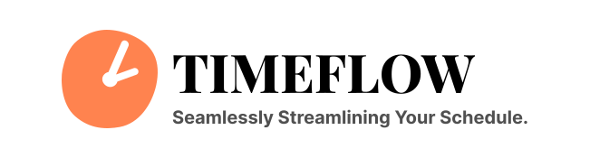

<div style="text-align: center;">
  
</div>

# TimeFlow: Seamlessly Streamlining Your Schedule

TimeFlow is a Python script that integrates Notion to-do lists with Google Calendar to streamline task management and scheduling.

## Technologies Used

- **Python**: Core programming language for scripting.
- **Notion API**: Interface for accessing and manipulating Notion databases.
- **Google Calendar API**: Interface for integrating with Google Calendar.

## Features

- Sync Notion to-do lists with Google Calendar events.
- Update Google Calendar based on tasks in Notion.
- Command-line interface for easy interaction.

## Contributing

Contributions are welcome! Please fork the repository, make any changes you want, and submit pull requests for any improvements or bug fixes.

Clone this repo

```sh
  git clone https://github.com/sellareddy18/Timeflow.git
```

## Credits

[Notion API in 5 minutes](https://indydevdan.com/dev/notion-in-5-minutes)

## Thank you

- Proudly created by [@sellareddy18](https://github.com/sellareddy18)
- Linkedin [@se18y](https://www.linkedin.com/in/se18y/)
